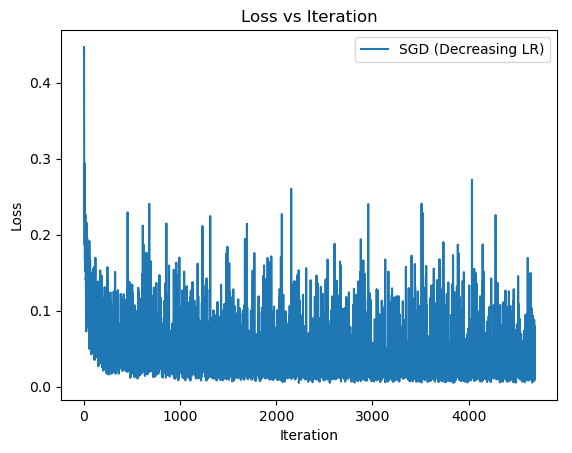

## Project 3 - MNIST Classifier and Optimization Report

## Group Members
- Mauricio Garcia-Paez
    - Wrote code implementing all 3 tasks
- Madelyn Good
    - README and Markdown report

## Project Overview
MNIST Optimization focuses on improving the accuracy, efficiency, and performance of a machine learning model. 

The [MNIST Dataset](https://www.kaggle.com/code/heeraldedhia/mnist-classifier-first-deep-learning-project) contains 70,000 images of handwritten digits: `0` through `9`. Each image is 28x28 pixels. For example, one image might be a handwritten `2` and is labeled as `2`.

The goal of this project is to train a model to recognize these digits from these images, and find ways to improve the model by using the following optimization algorithms:

- Stochastic Gradient Descent (SGD)
- SGD with Momentum
- Adam Optimizer (with and without bias correction)

This project is implemented using the provided MNIST Jupyter template. Each algorithm is extended using NumPy and MatPlotLib in Python.

## Task 0 - Base Model


This is the basic regression model we will be analyzing. This model is implemented with a fixed learning rate of `0.1.`


## Task 1 - Stochastic Gradient Descent (SGD)
In this task, we re-implement and optimize the base model to use SGD with three fixed learning rates: `0.1`, `0.01`, and `0.001`. 


Additionally, we implement a decreasing learning rate based on the formula:

$$
\alpha_t = \frac{\alpha_0}{1 + \lambda t}, \quad \text{where } \alpha_0 = 0.1, \ \lambda = 0.001
$$



These models loop through each learning rate to see how each setting affects stability and convergence speed.


## Task 2 - SGD With Momentum
In this task, we modify the SGD model in task 1 to include momentum based on the following:

$$ \beta_1 = 0.9 \quad \text{where } \beta = 0.9 \text{ is the momentum coefficient}
$$


This model is compared with the SGD model (without momentum) in task 1 to test if momentum has better convergence.


## Task 3 - Adam Optimizer
In this task, we implement two models: one with bias correction (standard Adam) and one without (for comparison). Standard Adam is implemented using: 

$$
\beta_1 = 0.9, \quad \beta_2 = 0.99, \quad \epsilon = 1 \times 10^{-8}
$$


Adam combines learning rates and momentum to test if bias correction affects convergence. Bias correction ensures that momentum is unbiased. Final loss is also compared.


## Results


### SGD vs Momentum 

- **SGD (lr = 0.1)**: Sharp initial convergence, sharp flucuations.
- **GD (lr = 0.01)**: Smooth convergence, stable flucuations.
- **SGD (lr = 0.001)**: Very slow convergence, stable flucuations.
- **SGD (lr = decreasing)**: Stablized over time, best overall behavior.
- **Momentum**: Sharp and fast.

### Adam

- **With Bias Correction**: Fast convergence, most stable overall.
- **Without Bias Correction**: Still fast, but not as stable at start.

### Final Loss Values
```
Final Loss (Vanilla SGD): 0.08656436052354327
Final Loss (Momentum SGD):  0.025288956714591613
Test Accuracy (Vanilla SGD): 0.9919
Test Accuracy (Momentum SGD): 0.9914
```


## How To Run Code
### Prerequisites
- Anaconda
- Jupyter Notebook

### Installation
1. Open Anaconda prompt, create and activate new environment 

    ```text
    conda create -n myenv python=3.9
    ```
    ```text
    conda activate myenv
    ```

2. Install required packages

    ```text
    conda install pytorch torchvision torchaudio cpuonly -c pytorch
    ```
    ```text
    conda install jupyter
    ```
    ```text
    conda install matplotlib
    ```

3. Launch Jupyter Notebook


